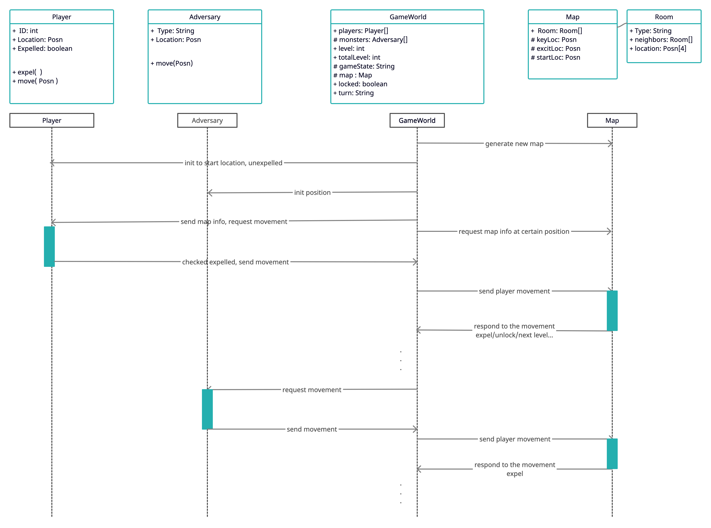

### diagram below is written for handin garding in case the png dons't work, need to read in the edit mode.
Player               Adversary                                     GameWorld                                Map

 |                       |                                             |  ----genrate a new map---------->   |
 
 |                       |  <------------init location---------------- |                                     |
 
 |                       |                                             |                                     |
 
 |   <--------------------init location(start position)--------------- |                                     |
 
 |                       |                                             |                                     |
 
 |                       |                                             |                                     |
 
 |                       |                                             | <-given map info at given location- |
 
 |  <--------------------request movement----------------------------  |                                     |
 
 |   --------------------check expelled,send movement--------------->  |                                     |
 
 |                       |                                             |                                     |
 
 |                       |                                             |                                     |
 
 |                       | <------------request movement-------------- |                                     |
 
 |                       | ------------send movement---------------->  |                                     |
 
 |                       |                                             | --send player/adversary movement--> |
 
 |                       |                                             | <-----respond to the movement-----  |
 
 |                       |                                             |                                     |
 
 |  <-------------------- expel player ------------------------------  |                                     |
 
 |                       |                                             |                                     |
 

